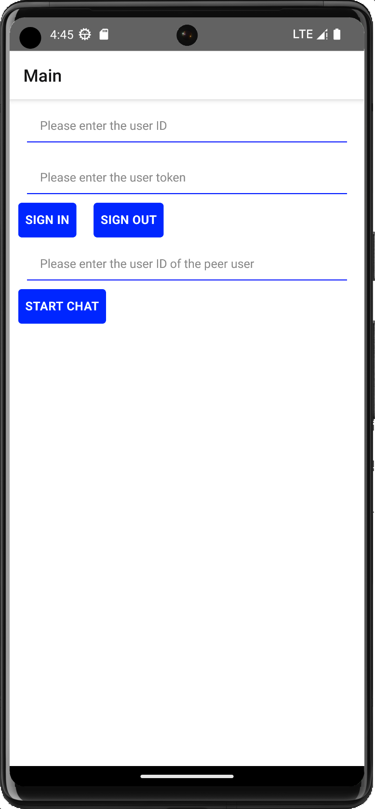

# Agora Chat React Native UIKit quick start guide

## Environment
* Node
```
> node --version
v21.7.3
```

## How to integrate Agora Chat UIKit step by step

### Creat project and do a quick testing
* Run commands below and make sure it works well with the default settings.
```
> react-native init chat_uikit --version 0.71.11
> cd chat_uikit
> yarn
> react-native run-android
```

### Add Agora Chat SDK and UIKit dependencies
```
> yarn add react-native-chat-sdk
> yarn add react-native-agora-chat-uikit
> react-native run-android
```

### Add other dependencies
```
> yarn add @react-navigation/native-stack
> yarn add @react-navigation/native
> yarn add @react-native-clipboard/clipboard
> yarn add react-native-file-access
> yarn add react-native-permissions
> yarn add @react-native-async-storage/async-storage
> yarn add @react-native-camera-roll/camera-roll
> yarn add react-native-safe-area-context
> yarn add react-native-screens
> react-native run-android
```

### Add code
* Replace the App.tsx with the [App.tsx](./App.tsx) within this repository.
  * Remember to change the appKey with yours.

### Testing
```
> react-native run-android
```

### Screenshots
* Main screen



* Chat screen


## Quick experience
* Clone the repository and run commands below.
```
> cd chat_uikit
> yarn
> react-native run-android
```
